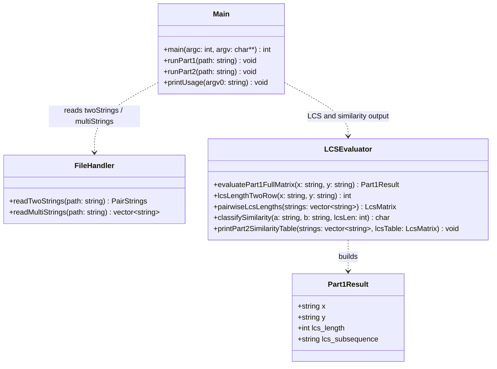
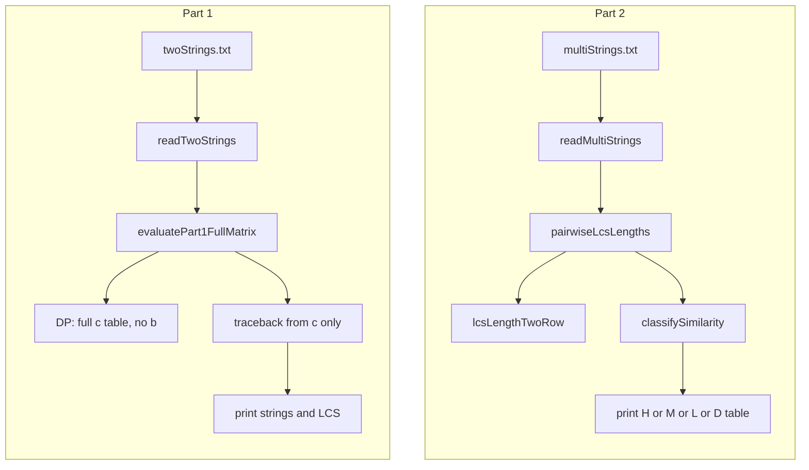

# UML Diagram

View this file on GitHub to render the diagrams below.

```mermaid
classDiagram
    class Part1Result {
        +string x
        +string y
        +int lcs_length
        +string lcs_subsequence
    }

    class Main {
        +main(argc: int, argv: char**) int
        +runPart1(path: string) void
        +runPart2(path: string) void
        +printUsage(argv0: string) void
    }

    class FileHandler {
        +readTwoStrings(path: string) PairStrings
        +readMultiStrings(path: string) vector~string~
    }

    class LCSEvaluator {
        +evaluatePart1FullMatrix(x: string, y: string) Part1Result
        +lcsLengthTwoRow(x: string, y: string) int
        +pairwiseLcsLengths(strings: vector~string~) LcsMatrix
        +classifySimilarity(a: string, b: string, lcsLen: int) char
        +printPart2SimilarityTable(strings: vector~string~, lcsTable: LcsMatrix) void
    }

    Main ..> FileHandler : reads twoStrings / multiStrings
    Main ..> LCSEvaluator : LCS and similarity output
    LCSEvaluator ..> Part1Result : builds
```

## Data flow (Part 1 and Part 2)

```mermaid
flowchart LR
    subgraph P1["Part 1"]
        T[twoStrings.txt] --> R1[readTwoStrings]
        R1 --> E1[evaluatePart1FullMatrix]
        E1 --> C1["DP: full c table, no b"]
        E1 --> TB[traceback from c only]
        TB --> O1[print strings and LCS]
    end

    subgraph P2["Part 2"]
        M[multiStrings.txt] --> R2[readMultiStrings]
        R2 --> PW[pairwiseLcsLengths]
        PW --> TR[lcsLengthTwoRow]
        PW --> SIM[classifySimilarity]
        SIM --> O2[print H or M or L or D table]
    end
    P1 ~~~ P2
```
